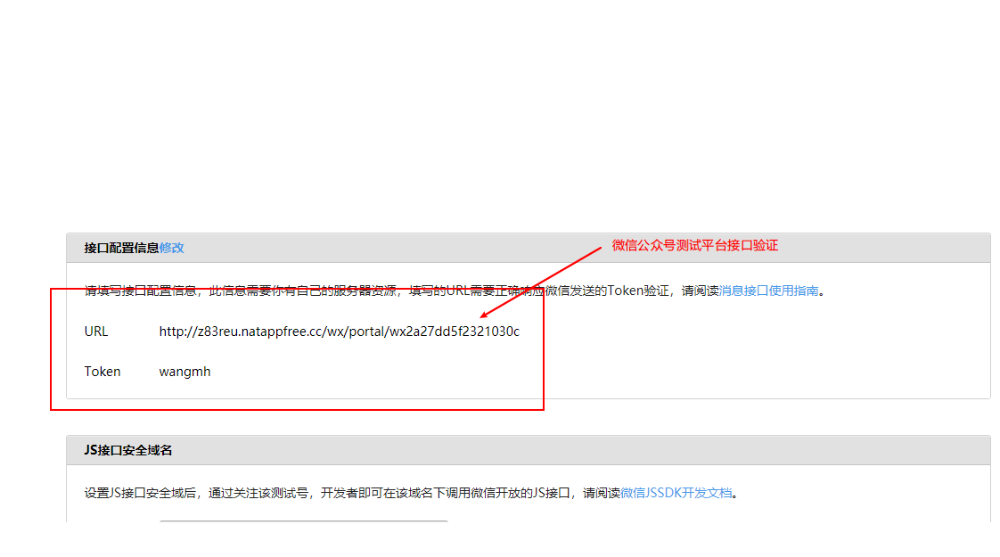

### 一、项目结构

> wmh-shop-parent
>
> -----wmh-shop-basics----分布式基础设施
>
> ---------wmh-shop-basics-alibaba-nacos—注册中心 8080
>
> ---------wmh-shop-basics-alibaba-nacos—分布式配置中心 8080  
>
> ---------wmh-shop-basics-alibaba-seata 分布式事务解决方案 8730
>
> ---------wmh-shop-basics-alibaba-canal mysql与redis一致性的问题
>
> ---------wmh-shop-basics-springcloud-gateway  统一请求入口 80  （已整合swaggerApi）
>
> ---------wmh-shop-basics-xuxueli-xxljob  分布式任务调度平台
>
> ---------wmh-shop-basics-codingapi-zipKin  分布式调用链系统
>
> 
>
> -----wmh-shop-service-api  提供公共接口
>
> ------------ wmh-shop-service-api-weixin  微信服务接口
>
> ------------ wmh-shop-service-api-member  会员服务接口
>
> ------------ wmh-shop-service-api-sso  sso服务接口
>
> ------------ wmh-shop-service-api-item  商品服务接口
>
> ------------ wmh-shop-service-api-search 搜索服务接口
>
> ------------ wmh-shop-service-api-pay  聚合支付平台
>
> ------------ wmh-shop-service-api-order  订单服务接口
>
> ------------ wmh-shop-service-api-spike  秒杀服务接口
>
> ------------ wmh-shop-service-api-sms  消息服务平台
>
> 
>
> 服务接口中包含内存内容: 实体类层、接口层 
>
> 
>
> -----wmh-shop-service-impl公共接口的实现
>
> ------------ wmh-shop-service-weixin 微信服务接口实现 9090
>
> ------------ wmh-shop-service-member  会员服务接口实现 7070
>
> ------------ wmh-shop-service-api-sso sso服务接口实现 6060 
>
> ------------ wmh-shop-service-tem  商品服务接口实现 5050
>
> ------------ wmh-shop-service-search 搜索服务接口实现 3030 
>
> ------------ wmh-shop-service-pay  聚合支付平台接口实现 2020 
>
> ------------ wmh-shop-service-order  订单服务接口实现 1010 
>
> ------------ wmh-shop-service-spike 秒杀服务接口 4040
>
> ------------ wmh-shop-service-sms 消息服务平台 9810
>
> 
>
> -----wmh-shop-common 工具类
>
> ---------wmh-shop-common-core—核心工具类
>
> 
>
> ----wmh-shop-service-job---任务调度工程
>
> ---------wmh-shop-service-member-job 会员服务job任务 9998
>
> 
>
> ----wmh-shop-pay- reconcile --- 支付对账任务
>
> ----wmh-shop-pay- sms --- 消息服务平台
>
> 
>
> -----wmh-shop-portal 门户平台 vue工程
>
> --------wmh-shop-portal-web 门户网站  支持PC端和H5端访问
>
> --------wmh-shop-portal-sso 单点登陆系统 
>
> --------wmh-shop-portal-search 搜索系统
>
> --------wmh-shop-portal-spike 秒杀系统
>
> --------wmh-shop-portal-cms 系统 


### 二、中间件地址信息

#### 1.Nacos

```
http://localhost:8848/nacos     nacos/nacos
http://192.168.75.128:8848/nacos     nacos/nacos
```

#### 2. Gitlab

```
http://192.168.75.128:8090/     admin/admin123456
```

#### 3.Nexus

```
http://192.168.75.128:8081/    admin/admin,wmh/wmh
```

#### 4.Mysql

```
192.168.75.128  3306  root/root
```

#### 5.Redis

```
192.168.75.128  6379
```

#### 6.xxl-job-admin

```
192.168.75.128:8888  admin/123456
```

#### 7.RabbitMQ

```
192.168.75.128:15672   guest/guest
```

### 三、中间件环境搭建

#### 1.Gitlab环境搭建

##### 1.1 下载镜像文件

```shell
docker pull beginor/gitlab-ce:11.0.1-ce.0
```

##### 1.2 创建Gitlab的配置（etc），日志（log），数据（data）放到容器之外，便于日后升级。

```shell
mkdir -p /mnt/gitlab/etc
mkdir -p /mnt/gitlab/log
mkdir -p /mnt/gitlab/data
```

##### 1.3 运行Gitlab容器

```shell
docker run \
    --detach \
    --publish 8443:443 \
    --publish 8090:80 \
    --name gitlab \
    --restart unless-stopped \
    -v /mnt/gitlab/etc:/etc/gitlab \
    -v /mnt/gitlab/log:/var/log/gitlab \
    -v /mnt/gitlab/data:/var/opt/gitlab \
    beginor/gitlab-ce:11.0.1-ce.0 
```

##### 1.4 修改/mnt/gitlab/etc/gitlab.rb

把external_url改成部署机器的域名或者IP地址

```shell
vi /mnt/gitlab/etc/gitlab.rb
external_url 'http://192.168.75.128:8090'
```

##### 1.5 修改/mnt/gitlab/data/gitlab-rails/etc/gitlab.yml

```shell
vi /mnt/gitlab/data/gitlab-rails/etc/gitlab.yml
```

找到关键字## Web server settings

将host的值改成映射的外部主机ip地址和端口

```yaml
gitlab:
	host: 192.168.75.128
    port: 8090
```

重启gitlab

```
docker restart gitlab
```

若运行gitlab时，映射的外部端口为8090，在重启gitlab时，上述port端口被刷新，需要修改gitlab.yml文件

（解决克隆地址上为端口问题，若运行容器时，映射的端口为80，无需以下操作）

```yaml
vi /mnt/gitlab/data/gitlab-rails/etc/gitlab.yml
## 将prot端口修改为8090
## 并进入容器中，并重启
docker exec -it gitlab /bin/bash
gitlab-ctl restart
```

gitlab可以正常访问。

##### 1.6 创建用户，创建项目


#### 2.Nexus环境搭建

##### 2.1 下载镜像

```shell
#1.下载一个nexus3的镜像
docker pull sonatype/nexus3
```

##### 2.2 运行Nexus容器

```shell
#2.将容器内部/var/nexus-data挂载到主机/root/nexus-data目录
docker run -d -p 8081:8081 --name nexus -v /root/nexus-data:/var/nexus-data --restart=always sonatype/nexus3
```

关闭防火墙，访问http://192.168.75.128:8081

进入容器获取初始密码：

```shell
docker exec -it nexus /bash/bin
vi /nexus-data/admin.password
```

默认登录账号：admin/获取的密码，并修改密码

##### 2.3  创建私服账户和仓库

创建账户（wmh/wmh），并赋予权限

创建maven2(hosted)，私人仓库：wmh-release （两种仓库类型：release和snapshot，两者同理）

修改maven-central仓库中心仓库地址为阿里云仓库

```
http://maven.aliyun.com/nexus/content/groups/public/
```

##### 2.4 修改本地maven，settings.xml文件

```xml
<mirrors>
    <mirror>
		<id>wmh</id>
		<name>Repository in My Orgnization</name>
		<url>http://192.168.75.128:8081/repository/maven-public/</url>
		<mirrorOf>*</mirrorOf>
	</mirror>
  </mirrors>
 

  <servers>
		<server>    
       <id>wmh</id>    
       <username>wmh</username>    
       <password>wmh</password>    
    </server>
  </servers>
  
   <profiles>

         <repository> 
		  <id>wmh</id> 
		  <url>http://192.168.75.128:8081/repository/maven-snapshots/</url> 
		  <releases><enabled>true</enabled><updatePolicy>always</updatePolicy></releases> 
		  <snapshots><enabled>true</enabled><updatePolicy>always</updatePolicy></snapshots> 
		</repository> 

  </profiles>
```

##### 2.5 打包本地jar包到私服

添加pom依赖：

```xml
<!--注意限定版本一定为RELEASE,因为上传的对应仓库的存储类型为RELEASE -->
	<!--指定仓库地址 -->
	<distributionManagement>
		<repository>
			<!--此名称要和.m2/settings.xml中设置的ID一致 -->
			<id>wmh</id>
			<url>http://192.168.75.128:8081/repository/wmh-release/</url>
		</repository>
	</distributionManagement>

	<build>
		<plugins>
			<!--发布代码Jar插件 -->
			<plugin>
				<groupId>org.apache.maven.plugins</groupId>
				<artifactId>maven-deploy-plugin</artifactId>
				<version>2.7</version>
			</plugin>
			<!--发布源码插件 -->
			<plugin>
				<groupId>org.apache.maven.plugins</groupId>
				<artifactId>maven-source-plugin</artifactId>
				<version>2.2.1</version>
				<executions>
					<execution>
						<phase>package</phase>
						<goals>
							<goal>jar</goal>
						</goals>
					</execution>
				</executions>
			</plugin>
		</plugins>
	</build>
```

执行命令：

```shell
mvn deploy
```

#### 3.Nacos环境搭建

##### 3.1 下载镜像

```shell
# 下载镜像
docker pull nacos/nacos-server
# 运行容器
docker run --env MODE=standalone --restart=always --name nacos -d -p 8848:8848 nacos/nacos-server
## 访问
http://192.168.75.128:8848/nacos    nacos/nacos
```

#### 4.Mysql

```shell
# 下载镜像
docker pull mysql:5.7
# 运行容器
docker run -p 3306:3306 --name mysql -e MYSQL_ROOT_PASSWORD=root -d mysql:5.7
```

#### 5.Redis

```shell
# 下载镜像
docker pull redis
# 运行容器
docker run -itd --name redis -p 6379:6379 --restart=always redis
```

#### 6.xxl-job-admin

官网：https://www.xuxueli.com/xxl-job/
```shell
#将xxl-job-admin-2.1.2.jar包放置服务器中，执行以下命令，jar在项目doc目录
nohup java -jar xxl-job-admin-2.1.2.jar >/data/logs/xxl.log 2>&1 &

##访问
http://192.168.75.128:8888/    admin/admin

##操作步骤
#1.创建执行器（AppName为本地项目配置文件中xxl.job.executor.appname）
#2.启动本地job工程
#3.在任务管理中，选择执行器并新增任务（填写基本信息）
#若想实现分片，可启动多个本地工程，改变其本地服务端口，及执行器端口测试，AppName必须相同
```

#### 7.RabbitMQ

```shell
# 下载镜像
docker pull rabbitmq:management
# 运行容器
docker run -itd -p 5672:5672 -p 15672:15672 --restart=always --name rabbitmq rabbitmq:management
# 访问可视化界面
http://192.168.75.128:15672/  guest/guest
```

### 四、外网映射工具

 https://natapp.cn/ 

```
natapp.exe -authtoken=xxxxxxxxx
```

### 五、微信公众号扫描登陆

参照：[微信官方开发文档](https://developers.weixin.qq.com/doc/offiaccount/Account_Management/Generating_a_Parametric_QR_Code.html)

> 原理：
>
> ​	1.通过用户id获取ticket凭证，生成带参数的链接（二维码链接）
>
> ​		—微信服务的getQrUrl接口生成
>
> ​		—(QR) https://mp.weixin.qq.com/cgi-bin/showqrcode?ticket =xxxxx
>
> ​	2.用户扫码识别时，则会将参数通知给微信回调接口 
>
> ​		—(微信回调接口) http://fqr3iw.natappfree.cc/wx/portal/ +appId
>
> ​	3.回调接口通过ticket凭证获取用户id，判断是否关联过openId，若没有关联，就进行关联
>
> ​		— 参照：ScanHandler（扫码已关注用户）、SubscribeHandler（扫码新用户关注）、UnsubscribeHandler（取消关注）

### 六、第三方联合登录实现

> oath2.0授权原理：
>
> 1.根据appId和appKey获取授权码
> 
> 2.根据授权码获取accesstoken
> 
> 3.根据accesstoken获取openId
> 
>4.根据openId获取用户信息

#### 1.QQ第三方登录

>测试AppID及APPKey：
>
>```
>AppID: 101410454
>AppKy: de56b00427f5970650c4f8ee3cfcfc2d
>网站地址：http://www.itmayiedu.com:7070
>回调地址：http://www.itmayiedu.com:7070/login/oauth/callback?unionPublicId=wmh_qq
>```
>
>注意：本地测试需配置host文件          127.0.0.1 [www.itmayiedu.com](http://www.itmayiedu.com)  
>
>文档资料 ：[QQ互联](https://wiki.connect.qq.com/%E4%BD%BF%E7%94%A8authorization_code%E8%8E%B7%E5%8F%96access_token)
>

实现思路：

##### 1.获取授权码Authorization Code

 ```
https://graph.qq.com/oauth2.0/authorize?response_type=code&client_id=${AppID}&redirect_uri=&{url}&state

#1.response_type：授权类型，默认code
#2.client_id：应用appId
#3.redirect_uri：成功授权后的回调地址，必须是注册appid时填写的主域名下的地址，注意需要将url进行URLEncode
#4.state：client端的状态值。用于第三方应用防止CSRF攻击，成功授权后回调时会原样带回。
#5.scope（可选）：请求用户授权时向用户显示的可进行授权的列表。
#6.display（可选）：仅PC网站接入时使用。用于展示的样式。不传则默认展示为PC下的样式。

案例：
https://graph.qq.com/oauth2.0/authorize?response_type=code&client_id=101410454&redirect_uri=http://www.itmayiedu.com:7070/login/oauth/callback?unionPublicId=wmh_qq
 ```

##### 2.通过授权码Authorization Code获取accessToken

```
https://graph.qq.com/oauth2.0/token?grant_type=authorization_code&client_id=${appId}&client_secret=${appKey}&code=${code}&redirect_uri=${url}

#1.grant_type：授权类型为authorization_code
#2.client_id：应用appId
#3.client_secret：应用appKey
#4.code:第一步返回的授权码Authorization Code
#5.redirect_uri：回调地址，同第一步回调地址

返回说明：
access_token=0F47FB9C8A1AEDD3D643AB7000C473DD&expires_in=7776000&refresh_token=66064228390D4F917ABA490345D5447D
#1.access_token：授权令牌
#2.expires_in：有效期，单位为秒。
#3.refresh_token：在授权自动续期步骤中，获取新的Access_Token时需要提供的参数。注：refresh_token仅一次有效

案例：
https://graph.qq.com/oauth2.0/token?grant_type=authorization_code&client_id=101410454&client_secret=de56b00427f5970650c4f8ee3cfcfc2d&code=A3D5BA3CABEEF331529138F6CCFCADF0&redirect_uri=http://www.itmayiedu.com:7070/login/oauth/callback?unionPublicId=wmh_qq

返回：access_token=0F47FB9C8A1AEDD3D643AB7000C473DD&expires_in=7776000&refresh_token=66064228390D4F917ABA490345D5447D
```

##### 3.通过accessToken获取用户OpenID_OAuth2.0

```
https://graph.qq.com/oauth2.0/me?access_token=${access_token}

#1.access_token：第二步获取的accessToken值

返回说明：
callback( {"client_id":"YOUR_APPID","openid":"YOUR_OPENID"} );
#1.openid是此网站上唯一对应用户身份的标识，网站可将此ID进行存储便于用户下次登录时辨识其身份，或将其与用户在网站上的原有账号进行绑定。


案例：
https://graph.qq.com/oauth2.0/me?access_token=0F47FB9C8A1AEDD3D643AB7000C473DD

返回：callback( {"client_id":"101410454","openid":"9123F2B68A93753597C07E6065EB4034"} )
```

##### 4.通过AppId、accessToken、openId获取用户信息

```
https://graph.qq.com/user/get_user_info?access_token=${otken}&oauth_consumer_key=${appId}&openid=${openId}

案例：
https://graph.qq.com/user/get_user_info?access_token=0F47FB9C8A1AEDD3D643AB7000C473DD&oauth_consumer_key=101410454&openid=9123F2B68A93753597C07E6065EB4034
```

#### 2.微信第三方登录

> 测试AppID及APPKey：
>
> ```
> AppID: wx2a27dd5f2321030c
> AppKy: d6881ac1b4e495a2e6f3159f72dea000
> 网站地址：http://www.itmayiedu.com:7070
> 回调地址：http://www.itmayiedu.com:7070/login/oauth/callback?unionPublicId=wmh_wechat
> ```
>
> 注意：本地测试需配置host文件          127.0.0.1  [www.itmayiedu.com](http://www.itmayiedu.com)  
>
> 文档资料 ：[微信开放文档]( https://developers.weixin.qq.com/doc/offiaccount/OA_Web_Apps/Wechat_webpage_authorization.html#0 )

##### 1. 用户同意授权，获取code

```
https://open.weixin.qq.com/connect/oauth2/authorize?appid=wx2a27dd5f2321030c&redirect_uri=http://www.itmayiedu.com:7070/loginQu/oauth/callback?unionPublicId=wmh_wechat&response_type=code&scope=snsapi_userinfo&state=wmh#wechat_redirect

#1.appid：应用appId
#2.redirect_uri：回调地址
#3.response_type：响应类型，默认code
#4.scope：应用授权作用域，snsapi_base （不弹出授权页面，直接跳转，只能获取用户openid），snsapi_userinfo （弹出授权页面，可通过openid拿到昵称、性别、所在地。并且， 即使在未关注的情况下，只要用户授权，也能获取其信息 ）
#5.state（可选）：重定向后会带上state参数，开发者可以填写a-zA-Z0-9的参数值，最多128字节
#6.#wechat_redirect：无论直接打开还是做页面302重定向时候，必须带此参数
```

##### 2. 通过code换取网页授权access_token

```
https://api.weixin.qq.com/sns/oauth2/access_token?appid=wx2a27dd5f2321030c&secret=d6881ac1b4e495a2e6f3159f72dea000&code=071qr0Ym0rOmjm1b2KXm0KK2Ym0qr0YH&grant_type=authorization_code
#1.appid：应用appId
#2.secret：应用秘钥
#3.code：填写第一步获取的code参数
#4.grant_type：填写为authorization_code

返回：
{
"access_token": "31_J29ufIUWbYf90yinw5iJXOYp4JkcjZzFw2wW7RBzqqFrxY0B5AfO7VU5Sr9589U-IbZMz_EQQz5qid9fHN9y7w",
"expires_in": 7200,
"refresh_token": "31_NgiO8ccyjOv7yzhmqL5MGFKpf-0yAys7LAb_4Q4tuWiy0mvqo-raA3QxrjBXi_SU4iTYAhRendbKGeWDfA4kQg",
"openid": "odRiAtxd0Piod7uKKOYGpxlIEYFI",
"scope": "snsapi_userinfo"
}
#1.access_token：网页授权接口调用凭证（授权令牌）
#2.expires_in：凭证超时时间
#3.refresh_token：用户刷新access_token
#4.openid：用户唯一标识
#5.scope：用户授权的作用域
```

##### 3.刷新access_token（如果需要）

```
https://api.weixin.qq.com/sns/oauth2/refresh_token?appid=wx2a27dd5f2321030c&grant_type=refresh_token&refresh_token=31_NgiO8ccyjOv7yzhmqL5MGFKpf-0yAys7LAb_4Q4tuWiy0mvqo-raA3QxrjBXi_SU4iTYAhRendbKGeWDfA4kQg
#1.appid：应用appId
#2.grant_type：填写为refresh_token
#3.refresh_token：填写通过access_token获取到的refresh_token参数

返回：
{
"access_token": "31_J29ufIUWbYf90yinw5iJXOYp4JkcjZzFw2wW7RBzqqFrxY0B5AfO7VU5Sr9589U-IbZMz_EQQz5qid9fHN9y7w",
"expires_in": 7200,
"refresh_token": "31_NgiO8ccyjOv7yzhmqL5MGFKpf-0yAys7LAb_4Q4tuWiy0mvqo-raA3QxrjBXi_SU4iTYAhRendbKGeWDfA4kQg",
"openid": "odRiAtxd0Piod7uKKOYGpxlIEYFI",
"scope": "snsapi_userinfo"
}
#1.access_token：网页授权接口调用凭证（授权令牌）
#2.expires_in：凭证超时时间
#3.refresh_token：用户刷新access_token
#4.openid：用户唯一标识
#5.scope：用户授权的作用域
```

##### 4. 拉取用户信息(需scope为 snsapi_userinfo)

```
https://api.weixin.qq.com/sns/userinfo?access_token=31_J29ufIUWbYf90yinw5iJXOYp4JkcjZzFw2wW7RBzqqFrxY0B5AfO7VU5Sr9589U-IbZMz_EQQz5qid9fHN9y7w&openid=odRiAtxd0Piod7uKKOYGpxlIEYFI&lang=zh_CN
#1.
```

##### 5.附：检验授权凭证（access_token）是否有效

```
https://api.weixin.qq.com/sns/auth?access_token=31_J29ufIUWbYf90yinw5iJXOYp4JkcjZzFw2wW7RBzqqFrxY0B5AfO7VU5Sr9589U-IbZMz_EQQz5qid9fHN9y7w&openid=odRiAtxd0Piod7uKKOYGpxlIEYFI
#1.access_token:网页授权接口调用凭证（授权令牌）
#2.openid：用户的唯一标识

返回：
{ "errcode":0,"errmsg":"ok"}
```

### 其他

#### 1.Swagger配置说明 doc.html

@Api：用在请求的类上，表示对类的说明
>
> tags="说明该类的作用，可以在UI界面上看到的注解"
>
> value="该参数没什么意义，在UI界面上也看到，所以不需要配置"


@ApiOperation：用在请求的方法上，说明方法的用途、作用
>
>value="说明方法的用途、作用"
>
>notes="方法的备注说明"


@ApiImplicitParams：用在请求的方法上，表示一组参数说明
@ApiImplicitParam：用在@ApiImplicitParams注解中，指定一个请求参数的各个方面

> name：参数名
>
> value：参数的汉字说明、解释
>
> required：参数是否必须传
>
> paramType：参数放在哪个地方
>
> header --> 请求参数的获取：@RequestHeader
>
> query --> 请求参数的获取：@RequestParam
>
> path（用于restful接口）--> 请求参数的获取：@PathVariable
>
> body（不常用）
>
> form（不常用）  
>
> dataType：参数类型，默认String，其它值dataType="Integer"    
>
> defaultValue：参数的默认值


@ApiResponses：用在请求的方法上，表示一组响应

@ApiResponse：用在@ApiResponses中，一般用于表达一个错误的响应信息

>  code：数字，例如400
>
>  message：信息，例如"请求参数没填好"
>
>  response：抛出异常的类


@ApiModel：用于响应类上，表示一个返回响应数据的信息

​      （这种一般用在post创建的时候，使用@RequestBody这样的场景，

​      请求参数无法使用@ApiImplicitParam注解进行描述的时候）

@ApiModelProperty：用在属性上，描述响应类的属性


#### 2.天气接口

心知天气接口：https://www.seniverse.com/ 

 [https://api.seniverse.com/v3/weather/now.json?key=SIWLv50PvVFMH0k2A&location=%E6%AD%A6%E6%B1%89&language=zh-Hans&unit=c](https://api.seniverse.com/v3/weather/now.json?key=SIWLv50PvVFMH0k2A&location=武汉&language=zh-Hans&unit=c) 


#### 3.微信公众号测试平台

 https://mp.weixin.qq.com/debug/cgi-bin/sandboxinfo?action=showinfo&t=sandbox/index 



### 问题及解决方案

#### 1.gateway网关整合Swagger时，swagger接口调试时，url地址重复问题

解决方法：yml文件gateway下配置以下

```yaml
      ## 解决swagger测试时，url地址重复
      x-forwarded:
        enabled: false
```

#### 2.如何获取真实客户端IP  

在会员服务中的request请求中，获取的ip是网关服务的服务ip，并不是真实的客户端ip。

解决方法：Nginx获取客户端ip，将真实ip放入请求头中，在会员服务中直接从请求头中获取

原因：服务之间存在多层代理。

Nginx配置：

```
	upstream shopforward{
		server 127.0.0.1:81;
	}

    server {
        listen       80;
        server_name  gateway.shop.com; ##在本地host中添加映射

        location / {
            proxy_pass http://shopforward/;
			proxy_set_header   Host             $host;
			proxy_set_header   X-Real-IP        $remote_addr;						
			proxy_set_header   X-Forwarded-For  $proxy_add_x_forwarded_for;
        }
     }
```


gateway网关配置：

```java
@Component
public class MyGlobelFilter implements GlobalFilter {
    @Override
    public Mono<Void> filter(ServerWebExchange exchange, GatewayFilterChain chain) {
        //  nginx 会从请求头中设置 客户端的真实ip放入网关
        String sourceIp = exchange.getRequest().getHeaders().getFirst("X-Real-IP");
        if (StringUtils.isEmpty(sourceIp)) {
            ServerHttpResponse response = exchange.getResponse();
            response.setStatusCode(HttpStatus.BAD_REQUEST);
            JSONObject jsonObject = new JSONObject();
            jsonObject.put("code", "500");
            jsonObject.put("msg", "sourceIp is null");
            DataBuffer buffer = response.bufferFactory().wrap(jsonObject.toJSONString().getBytes());
            return response.writeWith(Mono.just(buffer));
        }
        // 使用网关过滤
        return chain.filter(exchange);
    }
}
```

#### 3.xxl-job注意事项

问题：在测试环境中，虚拟机中服务连接定时任务工程失败

原因：1.本地电脑未关闭防火墙 2.在测试环境中，连接远程xxl-job-admin服务，务必配置好执行器地址，生产环境可不配，实现自动注册。

解决：1.关闭本地电脑防火墙 2.在配置文件中配置xxl.job.executor.ip的本地ip地址（局域网ip地址）


 


 


